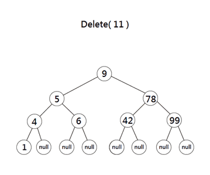
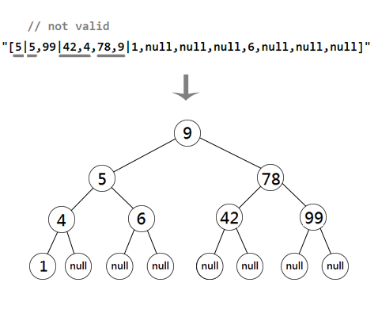

# BST builder, serializer and deserializer



* Purpose: 
This program support building a valid BST by an int array or a specific formatted string, common methods including *insertion, deletion, validation, contains(value), in/pre/post/level-order traversal(output by string or array)* and *height/ count* properties.
Furthermore, in order to optimized searching and traversal, it's build as an AVL.
* Concepts: 
Use bottom-up recursion(iteration) to build the BST, since height of every node is crucial to maintain AVL.
With the help of *SortedSet* in *System.Collections.Generic* namespace, this program could quickly rebuild after its validation failed.
* Preview:   
```
>> int[] values = new int[]{1,2,3,4,5,6,7,8,9};
>> var ex = new BSTbuilder(values);
>> Console.WriteLine(ex); 
[5 | 3, 8 | 2, 4, 7, 9 | 1, null, null, null, 6, null, null, null]
```
another example of build by an invalid string (with duplicates and false order)

```
>> var ex2 = new BSTbuilder("[5|5,99|42,4,78,9|1,null,null,null,6,null,null,null]"); // not valid, rebuild
>> Console.WriteLine(ex2); 
[9 | 5, 78 | 4, 6, 42, 99 | 1, null, null, null, null, null, null, null]
```


```
>> ex2.Delete(11); // this would do nothing since 11 is not in root
>> ex2.Delete(4);
>> Console.WriteLine(ex2.Insert(5));
false  // since 5 already in root

>> ex2.Insert(55);
>> Console.WriteLine(ex2);
[9 | 5, 78 | 1, 6, 42, 99 | null, null, null, null, null, 55, null, null]

>> Console.WriteLine(ex2.OrderVisualize("preorder"));
preorder : [ 9, 5, 1, 6, 78, 42, 55, 99 ] , height: 4, non-null elements: 8
```

